# Day 1: Experimental Design and Statistics

## Overview

### Lead Instructor
- [Fotis Psomopoulos](https://fpsom.github.io/) | [@fopsom](https://twitter.com/fopsom) | [email](mailto:fpsom@certh.gr)

### Co-Instructor(s)
- Maria Tsagiopoulou | [@tsayo7](https://twitter.com/tsayo7) [email](mariatsayo@gmail.com)

### Helper(s)
-


### General Topics

- Experiments: Design and Analysis
 - Components of an Experiment
 - What is a good experiment design?

- Statistics in Experimental Design
  - Batch effects and Confounding factors
  - Statistical inference
    - Random variables
    - The Null Hypothesis
  - Data Distributions and Multiple Hypotheses Adjustment Methods
    - Cumulative Distribution Functions
    - Histograms
    - Probability Distribution
    - Normal Distribution
    - t-test in practice
    - Confidence Interval
    - Power Calculations

## Schedule

- _**08:30 - 10:45**_ Registration, Administrative and Financial formalities

- _**10:45 - 11:30**_ Welcome plenary by CODATA-RDA & other sponsors. Coffee break.

- _**11:30 - 12:30**_ (_Lecture_) Experiments: Design and Analysis. Components of an Experiment. What is a good experiment design?

- _**12:30 - 14:00**_ _**Lunch break**_

- _**14:00 - 15:00**_ (_Hands-on_) Batch effects and Confounding factors.

- _**15:00 - 16:00**_ (_Hands-on_) Statistical inference.

- _**16:00 - 16:15**_ _**Coffee break**_

- _**16:15 - 18:00**_ (_Hands-on_) Data Distributions and Multiple Hypotheses Adjustment Methods.

## Learning Objectives

- Importance of a good experimental design
- Identify the key components of an experimental design
- Understand and identify confounding factors
- Understand p-value, confidence interval and power, including the underlying assumptions


## Experiments: Design and Analysis

> "To consult the statistician after an experiment is finished is often merely to ask him(her) to conduct a post mortem examination. He(she) can perhaps say what the experiment died of." _(–Ronald Fisher)_

The first part of this day will present the key components that one should take into consideration when designing an experiment.


The **slides** of the talk are available [**here**](https://raw.githubusercontent.com/fpsom/CODATA-RDA-Advanced-Bioinformatics-2019/master/files/slides/Experimental-Design-slides.pdf) and the responses of the [mentimeter](https://www.mentimeter.com/) exercises from the 2018 course are available [**here**](https://raw.githubusercontent.com/fpsom/CODATA-RDA-Advanced-Bioinformatics-2018/master/files/CODATA-RDA-Trieste-2018-mentimeter-responses.pdf).

### Batch effects and Confounding factors

Let's consider the following experiment:
- 150 individuals
- 50 of each treatment
- Treatment lasts 1 week
- We have 3 incubators/greenhouses/tanks/cages which each hold 50 individuals
- You have 3 undergrads. How should they split the data collection work?

#### A first look at the data

We will be using three main packages in R:
1. `tidyverse`
  The tidyverse is an opinionated collection of R packages designed for data science. All packages share an underlying design philosophy, grammar, and data structures.
2. `ggplot2`
  It is a system for declaratively creating graphics, based on [The Grammar of Graphics](http://amzn.to/2ef1eWp). You provide the data, tell `ggplot2` how to map variables to aesthetics, what graphical primitives to use, and it takes care of the details.
3. `rafalib`: Convenience Functions for Routine Data Exploration
  A series of shortcuts for routine tasks originally developed by Rafael A. Irizarry to facilitate data exploration.

We also need to download the `readCounts.csv` file that contains the data we will be looking though in the following exercise:

```
curl -LO https://raw.githubusercontent.com/fpsom/CODATA-RDA-Advanced-Bioinformatics-2019/master/files/data/readCounts.csv
```

We can now go to RStudio and have a first look at our data.

```
library(tidyverse)
library(ggplot2)
library(rafalib)

set.seed(1)

dataSamples <- read.csv("readCounts.csv")
summary(dataSamples)
```

The output should look like this:

```
Sample       Treatment       Week    Student     ReadCount          Lane     Library_Prep_Date
Min.   :  1.00   Blue :50   Min.   :1   John :50   Min.   : 22.0   Min.   :1.0   5/23/18:75       
1st Qu.: 38.25   Green:50   1st Qu.:1   Riley:50   1st Qu.: 73.0   1st Qu.:1.0   6/30/18:75       
Median : 75.50   Red  :50   Median :2   Sarah:50   Median : 87.5   Median :1.5                    
Mean   : 75.50              Mean   :2              Mean   : 87.4   Mean   :1.5                    
3rd Qu.:112.75              3rd Qu.:3              3rd Qu.:101.0   3rd Qu.:2.0                    
Max.   :150.00              Max.   :3              Max.   :186.0   Max.   :2.0  
```

In our case, let's consider that _"Blue"_ stands for control samples, and _"Red"/"Green"_ are different treatments applied to the samples.

#### Data looks good. Let's see a few plots

Let's have a look first on all sample points together.

```
ggplot(data=dataSamples) +
  geom_point(aes(x = Sample, y = ReadCount), size = 3) +
  stat_smooth(aes(x = Sample, y = ReadCount), method = "lm", formula = y ~ x, se = TRUE) +
  labs(x = "Sample", y = "Read Count", title = "All read counts") +
  theme(plot.title = element_text(hjust=0.5))
```

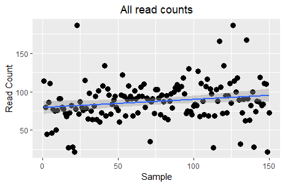

Although this plot is not very informative, some may interpret it as a slight trend for increase across samples. However, the key question here is the relationship between read counts and the different treatments. Let's see this:

```
ggplot(data=dataSamples) +
  facet_grid( ~ Treatment) +
  geom_point(aes(x = Sample, y = ReadCount, colour = Treatment), size = 3) +
  scale_color_manual(values=c("blue", "green", "red")) +
  stat_smooth(aes(x = Sample, y = ReadCount), method = "lm", formula = y ~ x, se = TRUE) +
  labs(x = "Sample", y = "Read Count", title = "All read counts") +
  theme(plot.title = element_text(hjust=0.5))
```

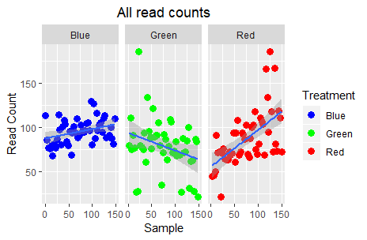

Ok, this is definitely more informative; the _"Blue"_ (control) read counts exhibit a slight increase, the _"Green"_ treatment a steep decrease, and the _"Red"_ treatment a steep increase. Are we done?

People tend to limit their analysis process to their target variables (the three groups and the read counts in this instance). However, the original experiment design, had a few more variables in place which may have had an impact in the measured values. Let's see what happens if we take the `Student` parameter into consideration:

```
ggplot(data=dataSamples) +
  facet_grid(Student ~ Treatment) +
  geom_point(aes(x = Sample, y = ReadCount, colour = Treatment), size = 3) +
  scale_color_manual(values=c("blue", "green", "red")) +
  stat_smooth(aes(x = Sample, y = ReadCount), method = "lm", formula = y ~ x, se = TRUE) +
  labs(x = "Sample", y = "Read Count", title = "ReadCounts ~ Treatment + Student") +
  theme(plot.title = element_text(hjust=0.5))
```


Aaah! What is happening to my **data**?! The previous "clear" story is starting to become a bit more complex. Taking the `Student` who did the sampling/processing into consideration, we now see that the read counts produced by `Riley`'s experiments exhibit less variation than `John`'s. Moreover, in the case of `Sarah` there is indeed visual difference between _"Blue"_ and _"Red"_ but not between _"Blue"_ and _"Green"_.

Let's try now to check the impact of the `week` variable with `treatment`:

```
ggplot(data=dataSamples) +
  facet_grid(Week ~ Treatment) +
  geom_point(aes(x = Sample, y = ReadCount, colour = Treatment), size = 3) +
  scale_color_manual(values=c("blue", "green", "red")) +
  stat_smooth(aes(x = Sample, y = ReadCount), method = "lm", formula = y ~ x, se = TRUE) +
  labs(x = "Sample", y = "Read Count", title = "ReadCounts ~ Treatment + Week") +
  theme(plot.title = element_text(hjust=0.5))
```

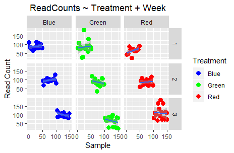


Finally, let's check out the impact of `Lane` and `Library_Prep_Date`:

```
ggplot(data=dataSamples) +
  facet_grid(Lane ~ Treatment) +
  geom_point(aes(x = Sample, y = ReadCount, colour = Treatment), size = 3) +
  scale_color_manual(values=c("blue", "green", "red")) +
  stat_smooth(aes(x = Sample, y = ReadCount), method = "lm", formula = y ~ x, se = TRUE) +
  labs(x = "Sample", y = "Read Count", title = "ReadCounts ~ Treatment + Lane") +
  theme(plot.title = element_text(hjust=0.5))


ggplot(data=dataSamples) +
  facet_grid(Library_Prep_Date ~ Treatment) +
  geom_point(aes(x = Sample, y = ReadCount, colour = Treatment), size = 3) +
  scale_color_manual(values=c("blue", "green", "red")) +
  stat_smooth(aes(x = Sample, y = ReadCount), method = "lm", formula = y ~ x, se = TRUE) +
  labs(x = "Sample", y = "Read Count", title = "ReadCounts ~ Treatment + Library_Prep_Date") +
  theme(plot.title = element_text(hjust=0.5))
```

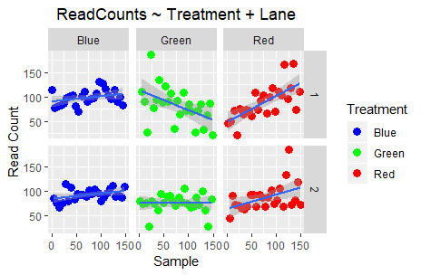

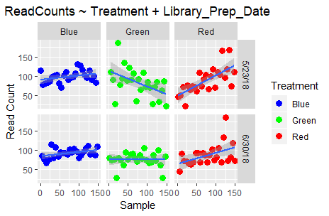

Do you observe any differences? Well, no; because `Lane` and `Library_Prep_Date`: are perfectly confounded!

All that stuff we discussed at the beginning is actually important in making sure that the final result is scientifically valid.

### Statistical inference

_The following material and exercises have been adapted from material in the [Data Analysis for the Life Sciences](https://leanpub.com/dataanalysisforthelifesciences) book by Rafael A Irizarry and Michael I Love_

First of all, we will introduce the statistical concepts necessary to understand p-values and confidence intervals. These terms are ubiquitous in the life science literature. Let’s use [this paper](http://diabetes.diabetesjournals.org/content/53/suppl_3/S215.full) as an example. Note that the abstract has this statement:
> _"Body weight was higher in mice fed the high-fat diet already after the first week, due to higher dietary intake in combination with lower metabolic efficiency."_

To support this claim they provide the following in the results section:

> _"Already during the first week after introduction of high-fat diet, body weight increased significantly more in the high-fat diet-fed mice (+ 1.6 +/- 0.1 g) than in the normal diet-fed mice (+ 0.2 +/- 0.1 g; P < 0.001)."_

What does `P < 0.001` mean? What are the `+/-` included?

#### A first look

Before we continue, we briefly explain the following important line of code:

```
set.seed(1)
```

Throughout these exercises, we use random number generators. This implies that many of the results presented can actually change by chance, including the correct answer to problems. One way to ensure that results do not change is by setting R’s random number generation seed.

Back to our data! Let's see if there is any difference in the observations of controls (i.e. _"Blue"_) vs the _"Green"_ treatment.

```
controlPop <- filter(dataSamples, Treatment == "Blue") %>% select(ReadCount) %>% unlist
treatmentPop <- filter(dataSamples, Treatment == "Green") %>% select(ReadCount) %>% unlist

print( mean(controlPop) )
# [1] 95.58

print( mean(treatmentPop) )
# [1] 78.86

obsdiff <- abs(mean(treatmentPop) - mean(controlPop))
print(obsdiff)
# [1] 16.72
```

So we see that the two groups have a difference of ~17% in read counts. Are we done? What about p-values and confidence intervals?

#### Random variables

Let's say that we somehow have access to the information of the entire control population (the 50 _"Blue"_ samples in this case). _Note that in practice we do not have access to the population. We have a special data set that we are using here to illustrate concepts._ If we randomly sample 10 of these every time, how does the average count change?

```
control <- sample(controlPop, 10)
mean(control)
# [1] 97.7

control <- sample(controlPop, 10)
mean(control)
# [1] 96.6

control <- sample(controlPop, 10)
mean(control)
# [1] 97.8
```

Note how the average varies. We can continue to do this repeatedly and start learning something about the distribution of this random variable.

#### The Null Hypotheses

Now let’s go back to our average difference of `obsdiff`. As scientists we need to be skeptics. How do we know that this `obsdiff` is due to the _"Green"_ treatment? What happens if we give all samples the same treatment? Will we see a difference this big? Statisticians refer to this scenario as the **null hypothesis**. The name _"null"_ is used to remind us that we are acting as skeptics: **we give credence to the possibility that there is _no_ difference**.

Because we have access to the population, we can actually observe as many values as we want of the difference of the averages when the treatment has no effect. We can do this by randomly sampling the 50 control cases and then recording the difference in mean between two randomly split groups of 10 and 10. Here is this process written in R code.

```
n <- 10000
null <- vector("numeric",n)
for (i in 1:n) {
  # 10 control samples
  control <- sample(controlPop, 10)
  # another 10 control samples that we act as if they were not
  treatment <- sample(controlPop, 10)
  null[i] <- mean(treatment) - mean(control)
}
```
The values in null form what we call the **null distribution**. So what percent of the 10,000 are bigger than `obsdiff`?

```
mean(null >= obsdiff)
# [1] 0.0011
```

Only a small percent of the 10,000 simulations. As skeptics what do we conclude? When there is no treatment effect, we see a difference as big as the one we observed only 0.1% of the time. This is what is known as a p-value.

### Data Distributions and Multiple Hypotheses Adjustment Methods

We have explained what we mean by _null_ in the context of null hypothesis, but what exactly is a distribution? The simplest way to think of a distribution is as a compact description of many numbers.

#### Cumulative Distribution Function
Scanning through the count numbers, we can start to get a rough idea of what the entire list looks like, but it is certainly inefficient. We can quickly improve on this approach by defining and visualizing a distribution. To define a distribution we compute, for all possible values of `a`, the proportion of numbers in our list that are below `a`. We use the following notation:

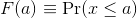

This is called the cumulative distribution function (CDF). When the CDF is derived from data, as opposed to theoretically, we also call it the empirical CDF (ECDF). The ECDF for the height data looks like this:

```
x <- controlPop
smallest <- floor( min(x) )
largest <- ceiling( max(x) )
values <- seq(smallest, largest,len=300)
heightecdf <- ecdf(x)
plot(values, heightecdf(values), type="l",
     xlab="a (Read counts)",ylab="Pr(x <= a)")
```

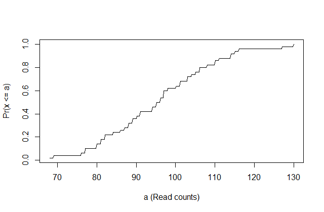

#### Histograms
Although the empirical CDF concept is widely discussed in statistics textbooks, the plot is actually not very popular in practice. The reason is that histograms give us the same information and are easier to interpret. Histograms show us the proportion of values in intervals:

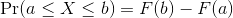

Plotting these counts as bars is what we call a histogram. It is a more useful plot because we are usually more interested in intervals, such and such percent are between 80 and 110 read counts, etc., rather than the percent less than a particular read count. It is also easier to distinguish different types (families) of distributions by looking at histograms. Here is a histogram of the control read counts, specifying also the bins and adding better labels:

```
# bins <- seq(smallest, largest) # bins of range 1
bins <- seq(60, 140, 10) # bins of range 10
hist(x, breaks=bins, xlab="Readcounts", main="Read Counts")
```
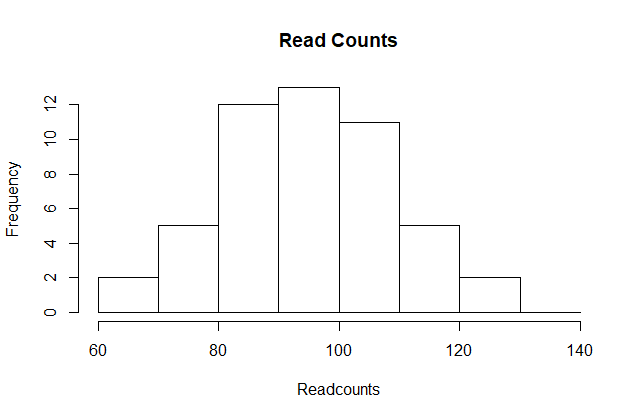

Showing this plot is much more informative than showing numbers. With this simple plot, we can approximate the number of individuals in any given interval. For example, there are about 7 samples with over 110 read counts.

#### Probability Distribution

Summarizing lists of numbers is one powerful use of distribution. An even more important use is describing the possible outcomes of a random variable. Unlike a fixed list of numbers, we don't actually observe all possible outcomes of random variables, so instead of describing proportions, we describe probabilities. For instance, if we pick a random read count from our list, then the probability of it falling between `a` and `b` is denoted with:


Note that the `X` is now capitalized to distinguish it as a random variable and that the equation above defines the probability distribution of the random variable. Knowing this distribution is incredibly useful in science. For example, in the case above, if we know the distribution of the difference in mean read counts in our control samples when the `null hypothesis` is true, referred to as the null distribution, we can compute the probability of observing a value as large as we did, referred to as a `p-value`. If you run this code, you can see the null distribution forming as the observed values stack on top of each other.

```
n <- 500
nullplot(-15, 15, -1, 45, xlab="Observed differences (diff counts)", ylab="Frequency")
totals <- vector("numeric",41)
for (i in 1:n) {
  control <- sample(controlPop, 10)
  treatment <- sample(controlPop, 10)
  nulldiff <- mean(treatment) - mean(control)
  j <- pmax(pmin(round(nulldiff)+20, 41), 1)
  totals[j] <- totals[j]+1
  text(j-20,totals[j],pch=15,round(nulldiff,1))
  # if(i < 15) Sys.sleep(1) ## You can add this line to see values appear slowly
}
```

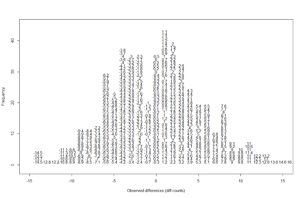

The figure above amounts to a histogram. From a histogram of the null vector we calculated earlier, we can see that values as large as `obsdiff` are relatively rare:

```
hist(null, freq=TRUE)
abline(v=obsdiff, col="red", lwd=2)
```


#### Normal Distribution

The probability distribution we see above approximates one that is very common in nature: the bell curve, also known as the normal distribution or Gaussian distribution. When the histogram of a list of numbers approximates the normal distribution, we can use a convenient mathematical formula to approximate the proportion of values or outcomes in any given interval:

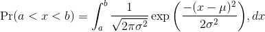

While the formula may look intimidating, don't worry, you will never actually have to type it out, as it is stored in a more convenient form (as `pnorm` in R which sets `a` to `-Inf`, and takes `b` as an argument).

Here `μ` and `σ` are referred to as the mean and the standard deviation of the population (we explain these in more detail in another section). If this normal approximation holds for our list, then the population mean and variance of our list can be used in the formula above. An example of this would be when we noted above that only 1.5% of values on the null distribution were above `obsdiff`. We can compute the proportion of values below a value `x` with `pnorm(x,mu,sigma)` without knowing all the values. The normal approximation works very well here:

```
1 - pnorm(obsdiff, mean(null), sd(null))
# [1] 0.001363058
```

So computing a `p-value` for the difference between control and treatment was pretty easy, right? But why are we not done? To make the calculation, we did the equivalent of buying/getting all possible samples and performing our experiment repeatedly to define the null distribution. Yet this is not something we can do in practice. Statistical Inference is the mathematical theory that permits you to approximate this with only the data from your sample, i.e. the original 10 samples.

**Exercise**

Download the file `mice_pheno.csv` from the material repository using the following command:

```
curl -LO https://raw.githubusercontent.com/fpsom/CODATA-RDA-Advanced-Bioinformatics-2019/master/files/data/mice_pheno.csv
```

You can now load this into RStudio with the following two commands:

```
dat <- read.csv("mice_pheno.csv")
dat <- na.omit( dat )
```

1. Use `dplyr` to create a vector x with the body weight of all males on the control (`chow`) diet. What is this population’s average?
2. Now use the `rafalib` package and use the `popsd` function to compute the population standard deviation.
3. Set the seed at `1`. Take a random sample `X` of size `25` from `x`. What is the sample average?
4. Use `dplyr` to create a vector y with the body weight of all males on the high fat (`hf`) diet. What is this population’s average?
5. Now use the `rafalib` package and use the `popsd` function to compute the population standard deviation.
6. Set the seed at `1`. Take a random sample `Y` of size `25` from `y`. What is the sample average?
7. What is the difference in absolute value between `mean(y) - mean(x)` and `mean(X) - mean(Y)`?
8. Repeat the above for females. Make sure to set the seed to `1` before each sample call. What is the difference in absolute value between `mean(y) - mean(x)` and `mean(X) - mean(Y)`?
9. For the females, our sample estimates were closer to the population difference than with males. What is a possible explanation for this?
  - The population variance of the females is smaller than that of the males; thus, the
sample variable has less variability.
  - Statistical estimates are more precise for females.
  - The sample size was larger for females.
  - The sample size was smaller for females.

#### t-test in Practice

**Central Limit Theorem**

The `CLT` is one of the most frequently used mathematical results in science. It tells us that when the sample size is large, the average `Y` of a random sample follows a normal distribution centered at the population average `μ` and with standard deviation equal to the population standard deviation `σ`, divided by the square root of the sample size `N`. We refer to the standard deviation of the distribution of a random variable as the random variable's standard error.

If we take many samples of size `N`, then the quantity:

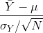

is approximated with a normal distribution centered at 0 and with standard deviation 1.

**The t-distribution**

The CLT relies on large samples, what we refer to as asymptotic results. When the CLT does not apply, there is another option that does not rely on asymptotic results. When the original population from which a random variable, say `Y`, is sampled is normally distributed with mean 0, then we can calculate the distribution of:

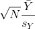

This is the ratio of two random variables so it is not necessarily normal. The fact that the denominator can be small by chance increases the probability of observing large values. [William Sealy Gosset](http://en.wikipedia.org/wiki/William_Sealy_Gosset), an employee of the Guinness brewing company, deciphered the distribution of this random variable and published a paper under the pseudonym "Student". The distribution is therefore called Student's t-distribution.

Let's run a t-test using 10 random samples from our two groups.
```
seed(1)

controlPop <- filter(dataSamples, Treatment == "Blue") %>% select(ReadCount) %>% unlist
treatmentPop <- filter(dataSamples, Treatment == "Green") %>% select(ReadCount) %>% unlist
control <- sample(controlPop, 10)
treatment <- sample(treatmentPop, 10)

diff <- abs(mean(treatment) - mean(control))
print(diff)

# [1] 18.8
```

We are asked to report a `p-value`. What do we do? We learned that `diff`, referred to as the _observed effect size_, is a random variable. We also learned that under the null hypothesis, the mean of the distribution of diff is 0. We use the sample standard deviation as an estimate of the population standard deviation. The standard error (SE) of this random variable is the population standard deviation divided by the square root of the sample size. In R, we simply use the `sd` function and the SE is:

```
sd(control) / sqrt( length(control) )
# [1] 3.658324
```

This is the SE of the sample average, but we actually want the SE of diff. We saw how statistical theory tells us that the variance of the difference of two random variables is the sum of its variances, so we compute the variance and take the square root:

```
se <- sqrt(
  var(treatment)/length(treatment) +
  var(control)/length(control)
)
```

Statistical theory tells us that if we divide a random variable by its SE, we get a new random variable with an SE of 1.

```
tstat <- diff / se
```

So now to calculate a `p-value` all we need to do is ask: how often does a normally distributed random variable exceed diff? R has a built-in function, `pnorm`, to answer this specific question. `pnorm(a)` returns the probability that a random variable following the standard normal distribution falls below `a`. To obtain the probability that it is larger than a, we simply use `1-pnorm(a)`. We want to know the probability of seeing something as extreme as `diff`: either smaller (more negative) than `-abs(diff)` or larger than `abs(diff)`. We call these two regions “tails” and calculate their size:

```
righttail <- 1 - pnorm(abs(tstat))
lefttail <- pnorm(-abs(tstat))
pval <- lefttail + righttail
print(pval)

# [1] 0.01579733
```

Alternatively we can use the function provided by R:

```
t.test(treatment, control)
```

The output should look something like the following:

```

	Welch Two Sample t-test

data:  treatment and control
t = -2.4136, df = 13.716, p-value = 0.0304
alternative hypothesis: true difference in means is not equal to 0
95 percent confidence interval:
 -35.538875  -2.061125
sample estimates:
mean of x mean of y
     74.7      93.5
```

The p-value is slightly bigger now. This is to be expected because our CLT approximation considered the denominator of t-stat practically fixed (with large samples it practically is), while the t-distribution approximation takes into account that the denominator (the standard error of the difference) is a random variable. The smaller the sample size, the more the denominator varies.

Now there is a problem. CLT works for large samples, but is 12 large enough? A rule of thumb for CLT is that 30 is a large enough sample size (but this is just a rule of thumb). The p-value we computed is only a valid approximation if the assumptions hold, which do not seem to be the case here.

#### Confidence interval

We have described how to compute p-values which are ubiquitous in the life sciences. However, we do not recommend reporting p-values as the only statistical summary of your results. The reason is simple: statistical significance does not guarantee scientific significance. With large enough sample sizes, one might detect a statistically significance difference in weight of, say, 1 microgram. But is this an important finding?

**Defining The Interval**

A 95% confidence interval (we can use percentages other than 95%) is a random interval with a 95% probability of falling on the parameter we are estimating.

```
seed(1)

controlPop <- filter(dataSamples, Treatment == "Blue") %>% select(ReadCount) %>% unlist

mu_control_pop <- mean(controlPop)
print(mu_control_pop)
# [1] 95.58

N <- 30
mu_control_sample <- sample(controlPop, N)
print(mean(mu_control_sample))
# [1] 94.93333

se <- sd(mu_control_sample)/sqrt(N)
print(se)
# [1] 2.526154

Q <- qnorm(1- 0.05/2)
interval <- c(mean(mu_control_sample)-Q*se, mean(mu_control_sample)+Q*se )
interval
# [1]  89.98216 99.88450


interval[1] < mu_control_pop & interval[2] > mu_control_pop
# [1] TRUE
```

which happens to cover `mean(controlPop)`. However, we can take another sample and we might not be as lucky. In fact, the theory tells us that we will cover the mean value 95% of the time. Because we have access to the population data, we can confirm this by taking several new samples. Let's try this for 250 random realizations of 95% confidence intervals. The color denotes if the interval fell on the parameter or not.

```
B <- 250
mypar()
plot(mean(controlPop) + c(-7,7), c(1,1), type="n", xlab="read count", ylab="interval", xlim = c(70, 120), ylim=c(1,B) )
abline(v = mean(controlPop))

for (i in 1:B) {
  control <- sample(controlPop, N)
  se <- sd(control) / sqrt(N)
  interval <- c(mean(control) - Q*se, mean(control) + Q*se)
  covered <- mean(controlPop) <= interval[2] & mean(controlPop) >= interval[1]
  color <- ifelse(covered, 1, 2)
  lines(interval, c(i,i), col = color)
}
```

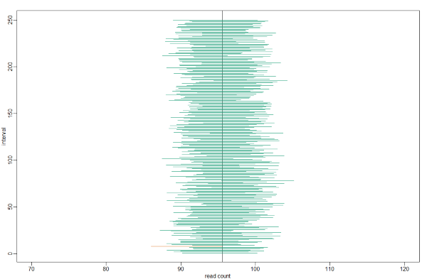

**Small Sample Size And The CLT**

For `N = 30`, the CLT works very well. However, if `N = 5`, do these confidence intervals work as well? We used the CLT to create our intervals, and with `N = 5` it may not be as useful an approximation. We can confirm this with a simulation:

```
mypar()
plot(mean(controlPop)+c(-7,7),c(1,1),type="n",xlab="read count",ylab="interval", xlim = c(70, 120), ylim=c(1,B))
abline(v=mean(controlPop))
# Q <- qnorm(1- 0.05/2) ##no longer normal so use:
Q <- qt(1- 0.05/2, df=4)
N <- 5
for (i in 1:B) {
  control <- sample(controlPop,N)
  se <- sd(control)/sqrt(N)
  interval <- c(mean(control)-Q*se, mean(control)+Q*se)
  covered <- mean(controlPop) <= interval[2] & mean(controlPop) >= interval[1]
  color <- ifelse(covered,1,2)
  lines(interval, c(i,i),col=color)
}
```

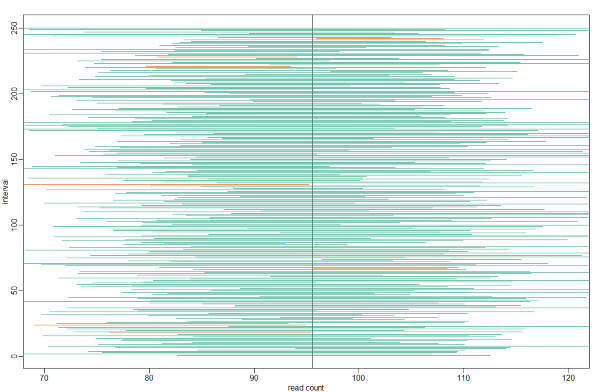

**Connection Between Confidence Intervals and p-values**

We recommend that in practice confidence intervals be reported instead of p-values. If for some reason you are required to provide p-values, or required that your results are significant at the 0.05 of 0.01 levels, confidence intervals do provide this information.

The confidence interval is provided by the `t.test` function:

```
seed(1)

controlPop <- filter(dataSamples, Treatment == "Blue") %>% select(ReadCount) %>% unlist
treatmentPop <- filter(dataSamples, Treatment == "Green") %>% select(ReadCount) %>% unlist

control <- sample(controlPop, 10)
treatment <- sample(treatmentPop, 10)

t.test(treatment,control)$conf.int

# [1] -36.579859   3.779859
# attr(,"conf.level")
# [1] 0.95

t.test(treatment,control)$p.value
# [1] 0.1035598
```

In this case, the 95% confidence interval does include 0 and we observe that the p-value is larger than 0.05 as predicted. If we change this to a 85% confidence interval, then:

```
t.test(treatment,control,conf.level=0.85)$conf.int

# [1] -30.752412  -2.047588
# attr(,"conf.level")
# [1] 0.85
```
0 is no longer in the confidence interval (which is expected because the p-value is smaller than 0.10).

#### Power Calculations

We have used the example of the effects of the treatment in the sample. Since in this illustrative example we have access to the population, we know that in fact there is a substantial (about 17%) difference between the read counts of the two groups:

```
controlPop <- filter(dataSamples, Treatment == "Blue") %>% select(ReadCount) %>% unlist
treatmentPop <- filter(dataSamples, Treatment == "Green") %>% select(ReadCount) %>% unlist

mu_tr <- mean(treatmentPop)
mu_control <- mean(controlPop)
print(abs(mu_tr - mu_control))
# [1] 16.72

print((abs(mu_tr - mu_control))/mu_control * 100) # percent difference

# [1] 17.4932
```

We have also seen that, in some cases, when we take a sample and perform a t-test, we don’t always get a p-value smaller than 0.05. For example, here is a case were we take sample of 5 and don’t achieve statistical significance at the 0.05 level:

```
N <- 5
tr <- sample(treatmentPop, N)
control <- sample(controlPop, N)
t.test(tr, control)$p.value

## [1] 0.3742463
```

Did we make a mistake? By not rejecting the null hypothesis, are we saying the diet has no effect? The answer to this question is no. All we can say is that we did not reject the null hypothesis. But this does not necessarily imply that the null is true. The problem is that, in this particular instance, we don’t have enough power, a term we are now going to define. If you are doing scientific research, it is very likely that you will have to do a power calculation at some point. In many cases, it is an ethical obligation as it can help you avoid sacrificing mice unnecessarily or limiting the number of human subjects exposed to potential risk in a study.

**Types Of Error**

Whenever we perform a statistical test, we are aware that we may make a mistake. This is why our p-values are not 0. Under the null, there is always a positive, perhaps very small, but still positive chance that we will reject the null when it is true. If the p-value is 0.05, it will happen 1 out of 20 times. This error is called type I error by statisticians. A type I error is defined as rejecting the null when we should not. This is also referred to as a false positive. So why do we then use 0.05? Shouldn’t we use 0.000001 to be really sure? The reason we don’t use infinitesimal cut-offs to avoid type I errors at all cost is that there is another error we can commit: to not reject the null when we should. This is called a type II error or a false negative. The R code analysis above shows an example of a false negative: we did not reject the null hypothesis (at the 0.05 level) and, because we happen to know and peeked at the true population means, we know there is in fact a difference. Had we used a p-value cutoff of 0.25, we would not have made this mistake. However, in general, are we comfortable with a type I error rate of 1 in 4? Usually we are not.

**Power Calculation**

Power is the probability of rejecting the null when the null is false. Of course “when the null is false” is a complicated statement because it can be false in many ways.

Statistical theory gives us formulas to calculate power. The `pwr` package performs these calculations for you. Here we will illustrate the concepts behind power by coding up simulations in R. Suppose our sample size is:

```
N <- 10
```

and we will reject the null hypothesis at:

```
alpha <- 0.05
```

What is our power with this particular data? We will compute this probability by re-running the exercise many times and calculating the proportion of times the null hypothesis is rejected. Specifically, we will run:

```
B <- 2000
```

simulations. The simulation is as follows: we take a sample of sizeN from both control and treatment groups, we perform a t-test comparing these two, and report if the p-value is less than alpha or not. We write a function that does this:

```
reject <- function(N, alpha=0.05){
  tr<- sample(treatmentPop, N)
  control <- sample(controlPop, N)
  pval <- t.test(tr,control)$p.value
  pval < alpha
}
```

Here is an example of one simulation for a sample size of 12. The call to reject answers the question “Did we reject?”

```
reject(10)
## [1] FALSE
```

Now we can use the replicate function to do this B times.

```
N <- 10
rejections <- replicate(B, reject(N))
```

Our power is just the proportion of times we correctly reject. So with N = 10 our power is only:

```
mean(rejections)
# [1] 0.388
```

This explains why the t-test was not rejecting when we knew the null was false. With a sample size of just 10, our power is about 40%. To guard against false positives at the 0.05 level, we had set the threshold at a high enough level that resulted in many type II errors.

Let’s see how power improves with `N`. We will use the function sapply, which applies a function to each of the elements of a vector. We want to repeat the above for the following sample size:

```
Ns <- seq(5, 50, 5)
```

So we use apply like this:

```
power <- sapply(Ns, function(N) {
  rejections <- replicate(B, reject(N))
  mean(rejections)
  } )

plot(Ns, power, type="b")  
```

Similarly, if we change the level alpha at which we reject, power changes. The smaller I want the chance of type I error to be, the less power I will have. Another way of saying this is that we trade off between the two types of error. We can see this by writing similar code, but keeping N fixed and considering several values of alpha:

```
N <- 30
alphas <- c(0.1,0.05,0.01,0.001,0.0001)
power <- sapply(alphas, function(alpha){
  rejections <- replicate(B, reject(N, alpha=alpha))
  mean(rejections)
  } )
plot(alphas, power, xlab="alpha", type="b", log="x")
```

There is no “right” power or “right” alpha level, but it is important that you understand what each means.

It is important to remember that p-values are not more interesting as they become very very small. Once we have convinced ourselves to reject the null hypothesis at a threshold we find reasonable, having an even smaller p-value just means that we sampled more mice than was necessary. A better statistic to report is the effect size with a confidence interval or some statistic which gives the reader a sense of the change in a meaningful scale. We can report the effect size as a percent by dividing the difference and the confidence interval by the control population mean:

```
N <- 20
tr <- sample(treatmentPop, N)
control <- sample(controlPop, N)
diff <- mean(tr) - mean(control)
diff / mean(control) * 100

t.test(tr, control)$conf.int / mean(control) * 100
```
The output is as follows:

```
[1] -40.3799649  -0.3743567
attr(,"conf.level")
[1] 0.95
```
