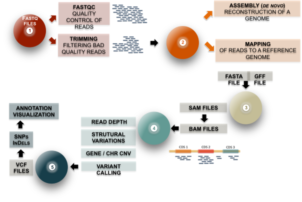

# Day 2: Introduction to basic NGS pipelines

## Overview

### Lead Instructor
- [Fotis Psomopoulos](https://fpsom.github.io/) | [@fopsom](https://twitter.com/fopsom) | [email](mailto:fpsom@certh.gr)

### Co-Instructor(s)
- [Amel Ghouila](https://github.com/amelgh) | [@AmelGhouila](https://twitter.com/AmelGhouila) | [email](mailto:amel.ghouila@gmail.com)

### Helper(s)
- Maria Tsagiopoulou | [@tsayo7](https://twitter.com/tsayo7) [email](mariatsayo@gmail.com)
-

### General Topics

- Introduction to basic NGS pipelines
  - Quality Assessment
    - `fastqc` / `multiqc`
    - `trimmomatic`
  - Mapping
    - `bwa mem`
  - Example pipeline: Variant Calling
    - `samtools` / `bcftools`

## Schedule

- _**09:00 - 10:00**_ Intro to NGS pipelines
- _**10:00 - 11:00**_ Short read quality and trimming (part 1)

- _**11:00 - 11:30**_ _**Coffee break**_

- _**11:30 - 12:30**_ Short read quality and trimming (part 2)

- _**12:30 - 14:00**_ _**Lunch break**_

- _**14:00 - 15:00**_ Mapping

- _**15:00 - 16:00**_ Variant calling (part 1)

- _**16:00 - 16:15**_ _**Coffee break**_

- _**16:15 - 18:00**_ Variant calling (part 1)


## Learning Objectives

- Use `fastqc` and `multiqc`
- Visualize read quality
- Quality filter and trim reads
- Distinguishing good/bad quality reads


## Introduction to basic NGS pipelines

The **slides** of the introductory talk are available [**here**](https://raw.githubusercontent.com/fpsom/CODATA-RDA-Advanced-Bioinformatics-2018/master/files/slides/Intro-NGS-slides.pdf)

### Basic DNASeq analysis/Variant calling workflow



_The following material and exercises are based on the **Next-Gen Sequence Analysis Workshop** that took place during the [Data Intensive Biology Summer Institute](http://ivory.idyll.org/dibsi/) at UC Davis, USA, 2-14/07/2018 (link [here](http://angus.readthedocs.io/en/2018/))_

### Quality Assessment

Learning objectives
1. Use `fastqc` and `multiqc`
2. Visualize read quality
3. Quality filter and trim reads
4. Distinguishing good/bad quality reads

We will use the following dataset. Run the command to download it locally:

```
curl -L -o ecoli_ref-5m.fastq.gz https://osf.io/frdz5/download
```

This is a FASTQ file -- let's take a look at it:

```
less ecoli_ref-5m.fastq.gz
```

(use the spacebar to scroll down, and type `q` to exit `less`)

Question:

* where does the filename come from?

Links:

* [FASTQ Format](http://en.wikipedia.org/wiki/FASTQ_format)

#### FastQC

We're going to use [FastQC](http://www.bioinformatics.babraham.ac.uk/projects/fastqc/) to summarize the data. We already installed `fastqc` above, with the conda command.

Now, run FastQC on the file:

```
fastqc ecoli_ref-5m.fastq.gz
```

Now type `ls`:

```
ls -d *fastqc.zip*
```

to list the files, and you should see:

```
ecoli_ref-5m_fastqc.zip
```

Inside the `fastqc` directory you will find the report from the `fastqc` program. You can also download my versions of the [html](https://raw.githubusercontent.com/fpsom/CODATA-RDA-Advanced-Bioinformatics-2018/master/files/NGSIntro_Output/ecoli_ref-5m.qc_fastqc.html) and [zip](https://raw.githubusercontent.com/fpsom/CODATA-RDA-Advanced-Bioinformatics-2018/master/files/NGSIntro_Output/ecoli_ref-5m_fastqc.zip) outputs.

**Questions**:

* What should you pay attention to in the FastQC report?

Links:

* [FastQC](http://www.bioinformatics.babraham.ac.uk/projects/fastqc/)
* [FastQC tutorial video](http://www.youtube.com/watch?v=bz93ReOv87Y)

There are several caveats about FastQC - the main one is that it only calculates certain statistics (like duplicated sequences) for subsets of the data (e.g. duplicate sequences are only analyzed for the first 100,000 sequences in each file


#### Trimmomatic

Now we're going to do some trimming!  We'll be using [Trimmomatic](http://www.usadellab.org/cms/?page=trimmomatic), which (as with `fastqc`) we've already installed via `conda`.

The first thing we'll need are the adapters to trim off (you might need to change the following command to reflect your own setup):

```
cp /home/fpsom/miniconda3/pkgs/trimmomatic-0.38-1/share/trimmomatic-0.38-1/adapters/TruSeq2-PE.fa .
```

You can look at the contents of this file with `cat TruSeq2-PE.fa` (you can download the same file from [here](https://raw.githubusercontent.com/fpsom/CODATA-RDA-Advanced-Bioinformatics-2018/master/files/NGSIntro_Output/TruSeq2-PE.fa))

Now, to run Trimmomatic on both of them:

```
trimmomatic SE ecoli_ref-5m.fastq.gz \
        ecoli_ref-5m.qc.fq.gz \
        ILLUMINACLIP:TruSeq2-PE.fa:2:40:15 \
        LEADING:2 TRAILING:2 \
        SLIDINGWINDOW:4:2 \
        MINLEN:25        
```

You should see output that looks like this:

```
...
Input Reads: 5000000 Surviving: 4996146 (99.92%) Dropped: 3854 (0.08%)
TrimmomaticSE: Completed successfully
```

Questions:

* How do you figure out what the parameters mean?
* How do you figure out what parameters to use?
* What adapters do you use?
* What version of Trimmomatic are we using here? (And FastQC?)
* Do you think parameters are different for RNAseq and genomic data sets?
* What's with these annoyingly long and complicated filenames?

For a discussion of optimal trimming strategies, see [MacManes, 2014](http://journal.frontiersin.org/Journal/10.3389/fgene.2014.00013/abstract) -- it's about RNAseq but similar arguments should apply to metagenome assembly.

Links:
* [Trimmomatic](http://www.usadellab.org/cms/?page=trimmomatic)

#### FastQC again

Run FastQC again on the trimmed files:

```
fastqc ecoli_ref-5m.qc.fq.gz
```

Let's take a look at the output files:

```
less ecoli_ref-5m.qc.fq.gz                                                    
```

(again, use spacebar to scroll,  `q` to exit less).

You can also download my versions of the [html](https://raw.githubusercontent.com/fpsom/CODATA-RDA-Advanced-Bioinformatics-2018/master/files/NGSIntro_Output/ecoli_ref-5m.qc_fastqc.html) and [zip](https://raw.githubusercontent.com/fpsom/CODATA-RDA-Advanced-Bioinformatics-2018/master/files/NGSIntro_Output/ecoli_ref-5m.qc_fastqc.zip) outputs.

#### MultiQc
[MultiQC](http://multiqc.info/) aggregates results across many samples into a single report for easy comparison.

Run `mulitqc` on both the untrimmed and trimmed files

```
multiqc .
```

And now you should see output that looks like this:

```
[INFO   ]         multiqc : This is MultiQC v1.6
[INFO   ]         multiqc : Template    : default
[INFO   ]         multiqc : Searching '.'
Searching 7 files..  [####################################]  100%
[INFO   ]          fastqc : Found 2 reports
[INFO   ]         multiqc : Compressing plot data
[INFO   ]         multiqc : Report      : multiqc_report.html
[INFO   ]         multiqc : Data        : multiqc_data
[INFO   ]         multiqc : MultiQC complete
```

Questions:
* is the quality trimmed data "better" than before?
* Does it matter that you still have adapters!?

**Exercise 1**

Try running `trimmomatic` with different paramaters in order to further improve / salvage your dataset. Try with different setups and identify the impact they have.

**Exercise 2**

Run the same steps for the following dataset that comes from the [Schurch et al, 2016 yeast RNAseq study](https://www.ncbi.nlm.nih.gov/pmc/articles/PMC4878611/):
```
curl -L https://osf.io/5daup/download -o ERR458493.fastq.gz
curl -L https://osf.io/8rvh5/download -o ERR458494.fastq.gz
curl -L https://osf.io/2wvn3/download -o ERR458495.fastq.gz
curl -L https://osf.io/xju4a/download -o ERR458500.fastq.gz
curl -L https://osf.io/nmqe6/download -o ERR458501.fastq.gz
curl -L https://osf.io/qfsze/download -o ERR458502.fastq.gz
```

### Mapping and Variant Calling

Learning objectives
1. Explore coverage
2. Understand the basics of mapping-based variant calling
3. Learn basics of actually calling variants & visualizing

We will use the dataset you cleaned (trimmed and filtered) during the previous exercise. You can make sure you have the correct data loaded if you get the following output:

```
ls -la

-rwxrwxrwx 1 fpsom fpsom  59532325 Aug 19 11:56 ERR458493.fastq.gz
-rwxrwxrwx 1 fpsom fpsom  59459449 Aug 19 12:02 ERR458493.qc.fq.gz
-rwxrwxrwx 1 fpsom fpsom  58566854 Aug 19 11:57 ERR458494.fastq.gz
-rwxrwxrwx 1 fpsom fpsom  58496906 Aug 19 12:02 ERR458494.qc.fq.gz
-rwxrwxrwx 1 fpsom fpsom  58114810 Aug 19 11:58 ERR458495.fastq.gz
-rwxrwxrwx 1 fpsom fpsom  58048466 Aug 19 12:03 ERR458495.qc.fq.gz
-rwxrwxrwx 1 fpsom fpsom 102201086 Aug 19 11:59 ERR458500.fastq.gz
-rwxrwxrwx 1 fpsom fpsom 102160038 Aug 19 12:03 ERR458500.qc.fq.gz
-rwxrwxrwx 1 fpsom fpsom 101222099 Aug 19 11:59 ERR458501.fastq.gz
-rwxrwxrwx 1 fpsom fpsom 101182595 Aug 19 12:04 ERR458501.qc.fq.gz
-rwxrwxrwx 1 fpsom fpsom 100585843 Aug 19 12:01 ERR458502.fastq.gz
-rwxrwxrwx 1 fpsom fpsom 100545339 Aug 19 12:10 ERR458502.qc.fq.gz
```

#### Download and gunzip the reference:

```
curl -O https://downloads.yeastgenome.org/sequence/S288C_reference/orf_dna/orf_coding.fasta.gz
gunzip orf_coding.fasta.gz
```
and look at it:

```
head orf_coding.fasta
```

#### Prepare it for mapping:

```
bwa index orf_coding.fasta
```

#### Map!

```
bwa mem -t 4 orf_coding.fasta ERR458493.qc.fq.gz  > ERR458493.sam
```

#### Observe!

```
head ERR458493.sam
```

what does all this mean??

#### Visualize mapping

Goal: make it possible to go look at a specific bit of the genome.

#### Index the reference genome:

```
samtools faidx orf_coding.fasta
```

#### Convert the SAM file into a BAM file:

```
samtools import orf_coding.fasta.fai ERR458493.sam ERR458493.bam
```

#### Sort the BAM file by position in genome:

```
samtools sort ERR458493.bam -o ERR458493.sorted.bam
```

### Index the BAM file so that we can randomly access it quickly:

```
samtools index ERR458493.sorted.bam
```

#### Visualize with `tview`:

```
samtools tview ERR458493.sorted.bam orf_coding.fasta
```

   `tview` commands of relevance:

   * left and right arrows scroll
   * `q` to quit
   * CTRL-h and CTRL-l do "big" scrolls
   * Typing `g` allows you to go to a specific location, in this format chromosome:location. Here are some locations you can try out:

     - `YLR162W:293` (impressive pileup, shows two clear variants and three other less clear)
     - `YDR034C-A:98` (impressive pileup, shows two clear variants)
     - `YDR366C:310` (impressive pileup, less clear variants)
     - `YLR256W:4420` (impressive pileup, less clear variants)
     - `YBL105C:2179` (less depth, shows two clear variants)
     - `YDR471W:152` (impressive pileup, shows one clear variant)

Get some summary statistics as well:

```
samtools flagstat ERR458493.sorted.bam
```

The output should look like this:

```
1092728 + 0 in total (QC-passed reads + QC-failed reads)
0 + 0 secondary
13 + 0 supplementary
0 + 0 duplicates
989419 + 0 mapped (90.55% : N/A)
0 + 0 paired in sequencing
0 + 0 read1
0 + 0 read2
0 + 0 properly paired (N/A : N/A)
0 + 0 with itself and mate mapped
0 + 0 singletons (N/A : N/A)
0 + 0 with mate mapped to a different chr
0 + 0 with mate mapped to a different chr (mapQ>=5)
```

#### Call variants!

Goal: find places where the reads are systematically different from the genome.

Now we can call variants using [samtools mpileup](http://samtools.sourceforge.net/mpileup.shtml):

```
samtools mpileup -u -t DP -f orf_coding.fasta ERR458493.sorted.bam | \
    bcftools call -mv -Ov > variants.vcf
```

You can download my version of the `variants.vcf` from [here](https://raw.githubusercontent.com/fpsom/CODATA-RDA-Advanced-Bioinformatics-2018/master/files/NGSIntro_Output/variants.vcf).

To look at the entire `variants.vcf` file you can do `cat variants.vcf`; all of the lines starting with `#` are comments.  You can use `tail variants.vcf` to see the last ~10 lines, which should be all of the called variants.

**Exercise 1**

Try to run the variant calling pipeline using one of the other `ERR458***` samples (i.e. `bwa mem`,  `samtools` etc). Can you identify differences in the new `vcf` file?

**Exercise 2**

In a realistic scenario, you don't want the variants per sample, but rather all the samples together (the mapping process is still done per sample). What would be the new `samtools mpileup` command that will incorporate multiple files in the variant calling process?

_solution_

```
samtools mpileup -D -u -t DP -f orf_coding.fasta ERR458493.sorted.bam ERR458494.sorted.bam ERR458495.sorted.bam ERR458500.sorted.bam ERR458501.sorted.bam ERR458502.sorted.bam | bcftools call -mv -Ov > variantsAll.vcf
```

You can download the new "full" `vcf` file from [here](https://raw.githubusercontent.com/fpsom/CODATA-RDA-Advanced-Bioinformatics-2018/master/files/NGSIntro_Output/variantsAll.vcf).

#### Discussion points / extra things to cover

* What are the drawbacks to mapping-based variant calling? What are the positives?
* Where do reference genomes come from?
