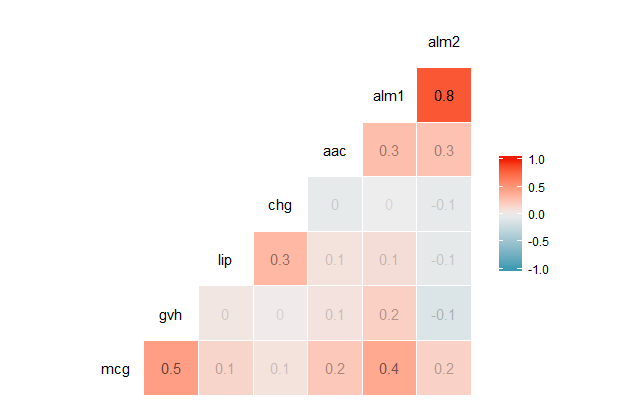
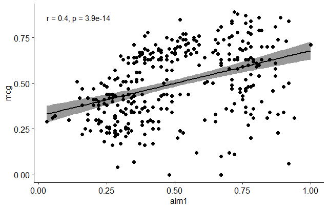
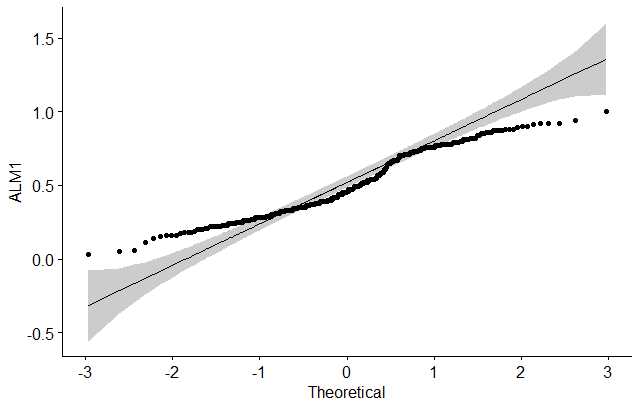
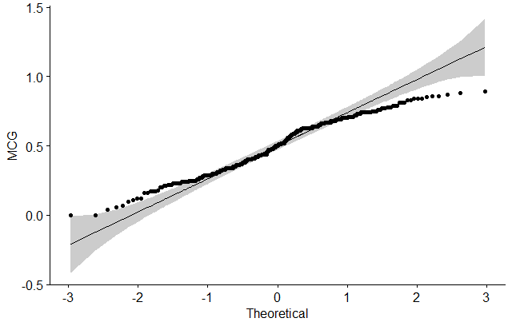
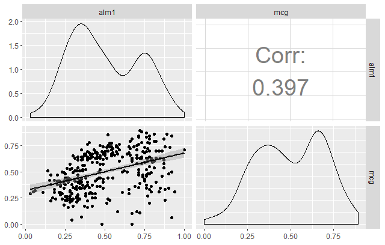

# Day 5: Metagenomics and Correlation in Life Sciences

## Overview

### Lead Instructor
- [Amel Ghouila](https://github.com/amelgh) | [@AmelGhouila](https://twitter.com/AmelGhouila) | [email](mailto:amel.ghouila@gmail.com)

### Co-Instructor(s)
- [Fotis Psomopoulos](https://fpsom.github.io/) | [@fopsom](https://twitter.com/fopsom) | [email](mailto:fpsom@certh.gr)

### Helper(s)
- Maria Tsagiopoulou | [@tsayo7](https://twitter.com/tsayo7) [email](mariatsayo@gmail.com)
-


### General Topics
- Metagenomics and Machine Learning
- Correlation and Linear Regression in Life Sciences


## Schedule

- _**09:00 - 10:00**_ Metagenomics and Machine Learning

- _**10:00 - 11:00**_ Correlation and Linear Regression in Life Sciences

- _**11:00 - 11:30**_ _**Coffee break**_

- _**11:30 - 12:30**_ Closing, Final Remarks, Post-workshop survey

- _**12:30 - 14:00**_ _**Lunch break**_


## Learning Objectives

- Basic overview of metagenomics: difference between targeted and shotgun metagenomics
- Overview of the different Machine Learning techniques / tools useful  in metagenomics
- Understanding of the difference between pearson, spearman and kendall correlation
- Understanding of the underlying assumptions of pearson correlation


## Metagenomics and Machine Learning

The **slides** of the talk are available [**here**](https://raw.githubusercontent.com/fpsom/CODATA-RDA-Advanced-Bioinformatics-2018/master/files/slides/ML_Metagenomics_DataTrieste18.pdf).

## Correlation and Linear Regression in Life Sciences

### Loading our dataset

For this episode, we will be using the [ecoli dataset](https://archive.ics.uci.edu/ml/datasets/ecoli) from the [UCI Machine Learning Repository](https://archive.ics.uci.edu/ml/datasets.html). The dataset contains 336 records (instances), each of which has 8 attributes (columns).

You can download the data also from **[here](https://raw.githubusercontent.com/fpsom/CODATA-RDA-Advanced-Bioinformatics-2018/master/files/data/ecoli.csv)**.

After downloading the data, we will load it in RStudio as follows:
```
dataSet <- read.csv(file = "ecoli.csv", header = TRUE, sep = ",", stringsAsFactors = TRUE)
```

### Basic Inspection of Your Data

It’s a good idea, once a data frame has been imported, to get an idea about your data. First, check out the structure of the data that is being examined. Below you can see the results of using this super-simple, helpful function `str()`:

```
str(dataSet)
```

```
'data.frame':	336 obs. of  9 variables:
$ Seq.Name: Factor w/ 336 levels "AAS_ECOLI","AAT_ECOLI",..: 2 3 4 5 6 8 9 12 13 14 ...
$ mcg     : num  0.49 0.07 0.56 0.59 0.23 0.67 0.29 0.21 0.2 0.42 ...
$ gvh     : num  0.29 0.4 0.4 0.49 0.32 0.39 0.28 0.34 0.44 0.4 ...
$ lip     : num  0.48 0.48 0.48 0.48 0.48 0.48 0.48 0.48 0.48 0.48 ...
$ chg     : num  0.5 0.5 0.5 0.5 0.5 0.5 0.5 0.5 0.5 0.5 ...
$ aac     : num  0.56 0.54 0.49 0.52 0.55 0.36 0.44 0.51 0.46 0.56 ...
$ alm1    : num  0.24 0.35 0.37 0.45 0.25 0.38 0.23 0.28 0.51 0.18 ...
$ alm2    : num  0.35 0.44 0.46 0.36 0.35 0.46 0.34 0.39 0.57 0.3 ...
$ class   : Factor w/ 8 levels "cp","im","imL",..: 1 1 1 1 1 1 1 1 1 1 ...
```

In this particular data frame, you can see from the console that 336 observations of 9 variables are present. Another great function to help us perform a quick, high-level overview of our data frame is `summary()`. Note the similarities and differences between the output produced by running` str()`.

```
summary(dataSet)
```

```
       Seq.Name        mcg              gvh            lip              chg              aac       
 AAS_ECOLI :  1   Min.   :0.0000   Min.   :0.16   Min.   :0.4800   Min.   :0.5000   Min.   :0.000  
 AAT_ECOLI :  1   1st Qu.:0.3400   1st Qu.:0.40   1st Qu.:0.4800   1st Qu.:0.5000   1st Qu.:0.420  
 ACEA_ECOLI:  1   Median :0.5000   Median :0.47   Median :0.4800   Median :0.5000   Median :0.495  
 ACEK_ECOLI:  1   Mean   :0.5001   Mean   :0.50   Mean   :0.4955   Mean   :0.5015   Mean   :0.500  
 ACKA_ECOLI:  1   3rd Qu.:0.6625   3rd Qu.:0.57   3rd Qu.:0.4800   3rd Qu.:0.5000   3rd Qu.:0.570  
 ADI_ECOLI :  1   Max.   :0.8900   Max.   :1.00   Max.   :1.0000   Max.   :1.0000   Max.   :0.880  
 (Other)   :330                                                                                    
      alm1             alm2            class    
 Min.   :0.0300   Min.   :0.0000   cp     :143  
 1st Qu.:0.3300   1st Qu.:0.3500   im     : 77  
 Median :0.4550   Median :0.4300   pp     : 52  
 Mean   :0.5002   Mean   :0.4997   imU    : 35  
 3rd Qu.:0.7100   3rd Qu.:0.7100   om     : 20  
 Max.   :1.0000   Max.   :0.9900   omL    :  5  
                                   (Other):  4   
```

A short description of the content of each attribute (as provided by [UCI](https://archive.ics.uci.edu/ml/machine-learning-databases/ecoli/ecoli.names)) is this:
1. **Seq.Name**: Accession number for the SWISS-PROT database
2. **mcg**: McGeoch's method for signal sequence recognition.
3. **gvh**: von Heijne's method for signal sequence recognition.
4. **lip**: von Heijne's Signal Peptidase II consensus sequence score. _Binary attribute._
5. **chg**: Presence of charge on N-terminus of predicted lipoproteins. _Binary attribute._
6. **aac**: score of discriminant analysis of the amino acid content of outer membrane and periplasmic proteins.
7. **alm1**: score of the ALOM membrane spanning region prediction program.
8. **alm2**: score of ALOM program after excluding putative cleavable signal regions from the sequence.
9. **class**: The class is the localization site.
    - cp _cytoplasm_
    - im _inner membrane without signal sequence_
    - pp _perisplasm_
    - imU _inner membrane, uncleavable signal sequence_
    - om _outer membrane_
    - omL _outer membrane lipoprotein_
    - imL _inner membrane lipoprotein_
    - imS _inner membrane, cleavable signal sequence_

### Methods for correlation analyses

(_the following exercises are based on the  [STHDA lesson](http://www.sthda.com/english/wiki/correlation-test-between-two-variables-in-r) and the [Data Camp Lesson](https://www.datacamp.com/community/blog/r-correlation-tutorial)_)

There are different methods to perform correlation analysis:
- **Pearson correlation (r)**, which measures a linear dependence between two variables (x and y). It’s also known as a parametric correlation test because it depends to the distribution of the data. It can be used only when x and y are from normal distribution. The plot of y = f(x) is named the **linear regression** curve.
- **Kendall tau** and **Spearman rho**, which are rank-based correlation coefficients (non-parametric)

_The most commonly used method is the Pearson correlation method._

Be careful, because there are always some assumptions that these correlations work with: the Kendall and Spearman methods only make sense for ordered inputs. This means that you’ll need to order your data before calculating the correlation coefficient.

Additionally, the default method, the Pearson correlation, assumes that your variables are normally distributed, that there is a straight line relationship between each of the variables and that the data is normally distributed about the regression line.

Note also that you can use `rcorr()`, which is part of the `Hmisc` package to compute the significance levels for pearson and spearman correlations.

### Compute correlation in R

Correlation coefficient can be computed using the functions `cor()` or `cor.test()`:

- `cor()` computes the correlation coefficient
- `cor.test()` test for association/correlation between paired samples. It returns both the correlation coefficient and the significance level (or p-value) of the correlation.

The simplified formats are:

```
cor(x, y, method = c("pearson", "kendall", "spearman"))
cor.test(x, y, method=c("pearson", "kendall", "spearman"))
```

where
- _x_, _y_: numeric vectors with the same length
- _method_: correlation method

If your data contain missing values, use the following R code to handle missing values by case-wise deletion.

```
cor(x, y,  method = "pearson", use = "complete.obs")
```

So, in our case let's run:

```
cor(dataSet$mcg, dataSet$gvh,  method = "pearson", use = "complete.obs")

# [1] 0.4548053
```

### Visualize your data using scatter plots

We will be using [`ggpubr`](https://cran.r-project.org/web/packages/ggpubr/index.html) to do our graphics. This is a library the contains "`ggplot2` Based Publication Ready Plots". We will also be using [`GGally`](https://cran.r-project.org/web/packages/GGally/index.html) which is an extension to `ggplot2`.

```
library("ggpubr")
library("GGally")
```

A correlation matrix enables us to quickly visualize which variables have a negative, positive, weak, or strong correlation to the other variables. The form of this function call will be `ggcorr(df)`, where df is the name of the data frame you’re calling the function on. The output of this function will be a triangular-shaped, color-coded matrix labelled with our variable names. The correlation coefficient of each variable relative to the other variables can be found by reading across and / or down the matrix, depending on the variable’s location in the matrix.

```
ggcorr(dataSet, label = TRUE, label_alpha = TRUE)
```

(Note that this will produce a warning saying _"data in column(s) 'Seq.Name', 'class' are not numeric and were ignored"_).



Correlation coefficients are always between -1 and 1, inclusive. A correlation coefficient of -1 indicates a perfect, negative fit in which y-values decrease at the same rate than x-values increase. A correlation coefficient of 1 indicates a perfect, positive fit in which y-values increase at the same rate that x-values increase.

Let's do now a scatter plot and see if we can visualize a relationship between some of the indicated variables, e.g. `mcg` and `alm1`. In order to do that, we'll use the `ggscatter` function as follows:

```
ggscatter(dataSet, x = "alm1", y = "mcg",
          add = "reg.line", conf.int = TRUE,
          cor.coef = TRUE, cor.method = "pearson",
          xlab = "alm1", ylab = "mcg")
```



### Preliminary test to check the test assumptions

1. Is the covariation linear?
  Yes, form the plot above, the relationship is linear. In the situation where the scatter plots show curved patterns, we are dealing with nonlinear association between the two variables.

2. Are the data from each of the 2 variables (x, y) follow a normal distribution?
    - use Shapiro-Wilk normality test –> R function: `shapiro.test()`
    - look at the normality plot —> R function: `ggpubr::ggqqplot()`

Shapiro-Wilk test can be performed as follows:

```
# Null hypothesis: the data are normally distributed
# Alternative hypothesis: the data are not normally distributed

# Shapiro-Wilk normality test for alm1
shapiro.test(dataSet$alm1) # => p = 1.431e-08

# Shapiro-Wilk normality test for mcg
shapiro.test(dataSet$mcg) # => p = 8.231e-06
```

Finally, let's do a visual inspection of the data normality using Q-Q plots (_quantile-quantile plots_). Q-Q plot draws the correlation between a given sample and the normal distribution.

```
# ALM1
ggqqplot(dataSet$alm1, ylab = "ALM1")
```



```
# MCG
ggqqplot(dataSet$mcg, ylab = "MCG")
```



### Pearson correlation test

Let's do now a correlation test between ALM1 and MCG variables:

```
res <- cor.test(dataSet$alm1, dataSet$mcg, method = "pearson")
res
```

The output will be:

```
Pearson's product-moment correlation

data:  dataSet$alm1 and dataSet$mcg
t = 7.9046, df = 334, p-value = 3.95e-14
alternative hypothesis: true correlation is not equal to 0
95 percent confidence interval:
0.3028477 0.4834391
sample estimates:
    cor
0.3969786
```

In the result above :

- **t** is the t-test statistic value (`t = 7.9046`),
- **df** is the degrees of freedom (`df= 334`),
- **p-value** is the significance level of the t-test (`p-value = 3.95e-14`).
- **conf.int** is the confidence interval of the correlation coefficient at _95%_ (`conf.int = [0.3028477, 0.4834391]`);
- **sample estimates** is the correlation coefficient (`cor.coeff = 0.3969786`).

### Tying it all together

Let’s now take a look at another powerful function available in `GGally` called `ggpairs`. This function is great because it allows users to create a matrix that shows the correlation coefficient of multiple variables in conjunction with a scatterplot (including a line of best fit with a confidence interval) and a density plot.

Using this one function, you can effectively combine everything you’ve covered in this tutorial in a concise, readily comprehensible fashion.

```
ggpairs(dataSet,
        columns = c("alm1", "mcg"),
        upper = list(continuous = wrap("cor", size = 10)),
        lower = list(continuous = "smooth"))
```



**Exercise**

Try to do all the steps we show today, but instead of `alm1` and `mcg`, use another pair of variables (e.g. `alm1` and `alm2`).
- Do you see the difference in correlation?
- Try using the `ggpairs` function, but with all the variables you studied (e.g. `c("alm1", "alm2", "mcg")`). Do you get a different interpretation of the results?

## Closing / Discussion

Our plan is to have a continuously improving workshop; so in order to do that we **_really_** like to have some feedback from you, as the participants of this course.

So please, go to the survey link [**here**](https://goo.gl/forms/Q8cSpbQx25CMyMU92) and spend the 5' necessary to answer a few questions. Thank you!
